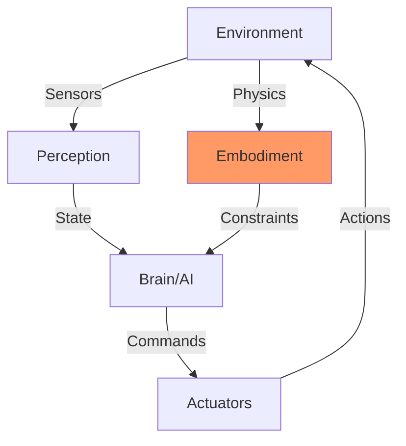
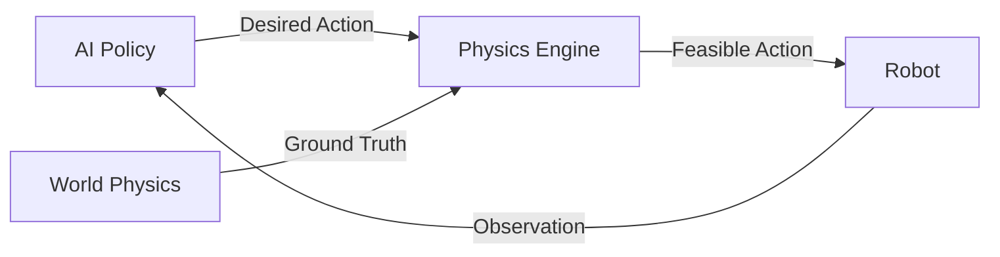
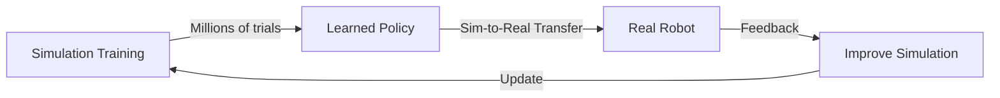

# Chapter 1: Introduction to Physical AI

## Overview

### What You'll Learn

By the end of this chapter, you will be able to:

- **Define** Physical AI and explain how it differs from traditional digital AI systems
- **Describe** the concept of embodied intelligence and its importance for robotics
- **Explain** why AI systems must understand physics to operate in the real world
- **Identify** key factors driving the current rise in humanoid robotics

### Prerequisites

Before starting this chapter, you should:

- ✅ Have read the [Preface](../preface/index.md) and understand course scope
- ✅ Understand basic AI/ML concepts (neural networks, training, inference)
- ✅ Have familiarity with Python programming (classes, functions)

**Recommended Background**:
- Awareness of current AI trends (LLMs, computer vision)
- Basic physics knowledge (force, mass, acceleration)

### Chapter Roadmap

This chapter is organized as follows:

1. **Background**: The evolution from digital AI to Physical AI
2. **Core Concepts**: Embodiment, physics integration, and humanoid emergence
3. **Implementation**: Setting up your learning environment
4. **Lab Exercises**: Exploring Physical AI examples
5. **Summary**: Key takeaways and connections

**Estimated Time**: 3-4 hours (Reading: 1.5 hours, Implementation: 1 hour, Labs: 1 hour)

---

## Background

### The AI Revolution: From Digital to Physical

For decades, AI research focused on problems that could be solved purely through computation: chess, language translation, image classification. These **digital AI** systems operate entirely in virtual spaces where physics doesn't exist.

**Digital AI Strengths**:
- Perfect information (no sensor noise)
- Infinite do-overs (reset to checkpoint)
- Deterministic execution (same input → same output)
- Instant action (no physical delays)

**Digital AI Limitations**:
- Cannot interact with physical world
- No understanding of causality or physics
- Brittle when deployed to robots
- Fails at tasks requiring embodiment

### The Moravec Paradox

In 1988, roboticist Hans Moravec observed a paradox:

> "It is comparatively easy to make computers exhibit adult-level performance on intelligence tests or playing checkers, and difficult or impossible to give them the skills of a one-year-old when it comes to perception and mobility."

**Why?**
- Chess requires logic, memorization, search (computational)
- Walking requires balance, proprioception, real-time physics (embodied)

Evolution spent millions of years optimizing physical intelligence, but only thousands on abstract reasoning. Our brains dedicate vast resources to sensorimotor control.

### Enter Physical AI

**Physical AI** represents the convergence of artificial intelligence and physical systems. These are AI systems that:

1. **Perceive** the world through sensors (cameras, IMUs, LiDAR)
2. **Reason** about physical properties (mass, friction, gravity)
3. **Act** through actuators (motors, grippers, manipulators)
4. **Learn** from physical interactions (reinforcement learning in real world)

**Key Difference**: Physical AI must handle uncertainty, delays, and irreversibility that digital AI never encounters.

---

## Core Concepts

### Concept 1: Embodied Intelligence

#### Definition

**Embodied Intelligence** is the theory that cognitive processes are shaped by the body's interaction with the environment. Intelligence cannot be separated from physical form.

#### Explanation

A robot's morphology (physical structure) fundamentally determines what it can learn and how it perceives the world.

**Example**: A humanoid robot with arms and legs can learn manipulation and walking through trial-and-error. A spherical robot cannot - its embodiment prevents those tasks.

**Diagram**:



*Figure 1.1: The embodied intelligence loop. Physical form (embodiment) constrains what the AI can sense and do.*

#### Key Characteristics

- **Morphology Matters**: Body shape determines affordances (what actions are possible)
- **Sensor-Motor Coupling**: Perception and action are inseparable
- **Environmental Grounding**: Intelligence emerges from environment interaction
- **Physical Constraints**: Mass, inertia, friction shape learning

### Concept 2: The Physics-AI Integration

#### Definition

Physical AI systems must integrate knowledge of physics (kinematics, dynamics, forces) with learned models to reliably interact with the world.

#### Explanation

Pure learning approaches (e.g., deep RL) can learn to walk, but they're sample-inefficient and fragile. Combining physics models with AI creates robust systems.

**Hybrid Approach**:
- **Physics Engine**: Simulates gravity, collisions, joint limits
- **AI Model**: Learns high-level policies (where to step, how to balance)
- **Integration**: AI policy respects physics constraints

**Diagram**:



*Figure 1.2: Physics engines mediate between AI intentions and physical reality.*

#### Why This Matters

- **Safety**: Physics prevents impossible/dangerous actions
- **Efficiency**: Models accelerate learning (vs. pure trial-and-error)
- **Generalization**: Physics knowledge transfers across scenarios

### Concept 3: The Rise of Humanoid Robotics

#### Historical Context

**1960s-1990s**: Early humanoid research (WABOT-1, Honda P-series)
- Limited computation
- Expensive hardware
- Hand-coded behaviors

**2000s-2010s**: ASIMO, Atlas, Pepper
- Better sensors and actuators
- Still hand-engineered
- Limited autonomy

**2020s-Present**: Optimus, Unitree G1, Figure 01
- AI-driven (reinforcement learning, VLA)
- Cost reduction (Unitree G1 ~$16K vs. ASIMO $2.5M)
- Real-world deployment focus

#### Why Now?

Three convergent trends:

1. **AI Breakthroughs**:
   - Deep RL (can learn walking, manipulation)
   - Vision-Language Models (understand commands)
   - Sim-to-Real (transfer from simulation to hardware)

2. **Hardware Advances**:
   - Cheap actuators and sensors
   - Edge AI chips (Jetson, Neural Engine)
   - 3D printing for rapid prototyping

3. **Economic Drivers**:
   - Labor shortage in manufacturing/logistics
   - Aging populations (care robotics)
   - Hazardous environment work (nuclear, space)

#### The Humanoid Form Factor

**Why humanoid shape?**

Not because it's optimal for any specific task, but because:
- Human environments designed for humans (stairs, doors, handles)
- Leverages human demonstration data (imitation learning)
- General-purpose platform (one robot, many tasks)

**Trade-offs**:
- Complex (many degrees of freedom)
- Unstable (bipedal balancing)
- Expensive to manufacture
- BUT: Highly versatile

### Relationships Between Concepts

Physical AI requires:
1. **Embodiment** to interact with the world
2. **Physics integration** for safe, efficient action
3. **Humanoid form** (often) for versatility in human spaces

These concepts form the foundation for everything in this course.

---

## Implementation

### Setup

This introductory chapter focuses on conceptual understanding. Implementation begins in Chapter 5 (ROS 2), but we'll set up your learning environment now.

#### System Requirements

**Hardware**:
- Ubuntu 22.04 workstation (see [Requirements](../preface/requirements.md))
- 16GB+ RAM recommended for later chapters

**Software**:
- Python 3.10
- Git for version control

#### Installation

Verify your setup:

```bash
# Check Python version
python3 --version
# Expected output: Python 3.10.x

# Check Git
git --version
# Expected output: git version 2.x.x

# Create course workspace
mkdir -p ~/robotics_course
cd ~/robotics_course
```

### Tutorial 1: Exploring Physical AI Examples

#### Objective

Research and document real-world Physical AI systems to understand current state-of-the-art.

#### Step 1: Tesla Optimus

Watch Tesla's latest Optimus demonstration (search YouTube: "Tesla Optimus latest"):

Observe:
- What tasks can it perform?
- How does it perceive the environment (cameras)?
- What are its limitations?

#### Step 2: Boston Dynamics Atlas

Watch Atlas humanoid videos:

Note:
- Locomotion capabilities (parkour, backflips)
- Manipulation skills (picking objects)
- Recovery behaviors (how it responds to pushes)

#### Step 3: Research Comparison

Create a comparison table:

| Platform | Strengths | Limitations | AI Approach |
|----------|-----------|-------------|-------------|
| Tesla Optimus | Vision-based, VLA integration | Speed, dexterity | End-to-end learning |
| Boston Dynamics Atlas | Locomotion, agility | Not commercially available | Model-based control + RL |
| Unitree G1 | Affordable, available | Less capable than Atlas | Hybrid |

### Tutorial 2: Physics Simulation Preview

We'll do a preview of what's coming in Part III (Gazebo) and Part IV (Isaac Sim).

#### Objective

Understand why simulation is critical for Physical AI development.

#### Concept: The Simulation-Reality Gap

**Problem**: Training robots in the real world is:
- Expensive (hardware breaks)
- Dangerous (robot could hurt people)
- Slow (1x real-time only)

**Solution**: Train in simulation (cheap, safe, 1000x real-time), transfer to reality.

**Diagram**:



*Figure 1.3: The simulation-to-reality training cycle.*

#### The Challenge

Simulations aren't perfect. They must model:
- Physics (gravity, friction, collisions)
- Sensors (camera noise, depth errors)
- Actuators (motor lag, torque limits)

**Domain Randomization**: Vary simulation parameters to improve real-world generalization.

---

## Lab Exercises

### Lab 1: Physical AI Research Report

#### Difficulty

🟢 **Beginner**

#### Estimated Time

1-2 hours

#### Objective

Research a Physical AI system and write a technical summary analyzing its capabilities, approach, and limitations.

#### Instructions

**Part 1: System Selection**

Choose ONE of:
- Tesla Optimus
- Boston Dynamics Atlas
- Unitree G1 / H1
- Agility Digit
- Figure 01

**Part 2: Research**

Find and review (minimum 3 sources):
- Official videos/demonstrations
- Technical papers or blog posts
- News coverage or interviews

**Part 3: Analysis**

Write a 500-word report covering:

1. **System Overview** (100 words)
   - Purpose and target applications
   - Key hardware specifications
   - Development timeline

2. **AI Approach** (200 words)
   - What AI techniques are used? (RL, imitation learning, VLA)
   - How does it perceive the environment?
   - What is the control architecture?

3. **Physical Intelligence** (100 words)
   - What physical skills has it mastered? (walking, manipulation, etc.)
   - How does embodiment shape its capabilities?

4. **Limitations and Future Directions** (100 words)
   - What can't it do yet?
   - What are the main technical challenges?
   - Your predictions for next 2-3 years

#### Deliverables

- [ ] Written report (500+ words)
- [ ] Bibliography with at least 3 sources
- [ ] Screenshot or image of the robot

#### Validation Criteria

Your report must:

- ✅ Clearly identify AI techniques used (not just "it uses AI")
- ✅ Connect physical form to capabilities (embodiment analysis)
- ✅ Cite specific sources (not just general knowledge)
- ✅ Demonstrate critical thinking (not just summarizing marketing)

#### Hints

<details>
<summary>💡 Hint 1: Finding Technical Details</summary>

Look for:
- Company blog posts (often more technical than news)
- Academic papers from company researchers
- Conference presentations (ICRA, IROS, RSS)
- GitHub repositories (if open-source)

</details>

<details>
<summary>💡 Hint 2: Understanding AI Approach</summary>

Key questions:
- Does it use vision only, or also other sensors?
- Is control model-based (classical control) or learned (RL)?
- Is there human teleoperation, or full autonomy?
- What's the role of simulation in development?

</details>

---

## Summary

### Key Takeaways

In this chapter, you learned:

1. **Physical AI vs. Digital AI**: Physical AI must handle real-world physics, sensor noise, and irreversibility unlike digital AI systems
2. **Embodied Intelligence**: The body's physical structure shapes what and how a robot can learn
3. **Physics Integration**: Combining physics models with AI creates safer and more efficient systems
4. **Humanoid Rise**: Convergence of AI breakthroughs, hardware advances, and economic drivers makes humanoid robots viable now

### Connections to Other Topics

This chapter relates to:

- **[Chapter 2: Humanoid Landscape](./02-humanoid-landscape.md)**: Detailed survey of current platforms
- **[Chapter 3: Sensor Foundations](./03-sensor-foundations.md)**: How robots perceive (essential for Physical AI)
- **[Chapter 9: Gazebo Simulation](../03-gazebo-unity/09-gazebo-intro.md)**: Tools for training Physical AI safely
- **[Part V: VLA Systems](../05-vla/index.md)**: Adding language understanding to Physical AI

### Additional Resources

**Official Documentation**:
- [Tesla AI Day presentations](https://www.tesla.com/AI)
- [Boston Dynamics research](https://www.bostondynamics.com/resources)
- [Unitree Robotics](https://www.unitree.com/)

**Research Papers**:
- Cully et al. (2015): "Robots that can adapt like animals" - Nature
- Andrychowicz et al. (2020): "Learning Dexterous In-Hand Manipulation" - OpenAI
- Peng et al. (2018): "Sim-to-Real Transfer of Robotic Control with Dynamics Randomization"

**Community Resources**:
- [r/robotics](https://reddit.com/r/robotics) - Reddit community
- [ROS Discourse](https://discourse.ros.org/) - Official ROS forum
- [Papers With Code - Robotics](https://paperswithcode.com/area/robotics)

### Self-Assessment

Test your understanding:

1. **Question 1**: What is the Moravec Paradox, and what does it tell us about Physical AI?
   <details>
   <summary>Show Answer</summary>

   The Moravec Paradox observes that tasks easy for humans (walking, perception) are hard for AI, while tasks hard for humans (chess, math) are easy for AI. This tells us that Physical AI requires fundamentally different approaches than digital AI - we can't just scale up computation, we must address embodiment and physics.
   </details>

2. **Question 2**: Why do many robots train in simulation rather than the real world?
   <details>
   <summary>Show Answer</summary>

   Simulation training is: (1) Cheaper - no hardware costs or breakage, (2) Safer - robot can't hurt people or itself, (3) Faster - can run 1000x real-time, enabling millions of trials. The challenge is transferring learned policies from simulation to reality (sim-to-real gap).
   </details>

3. **Question 3**: Why choose the humanoid form factor instead of specialized designs?
   <details>
   <summary>Show Answer</summary>

   Humanoid form is chosen for versatility, not optimal performance. Human environments (stairs, doors, tools) are designed for human morphology. Humanoids can leverage human demonstration data and serve as general-purpose platforms. The trade-off is higher complexity and cost compared to task-specific designs.
   </details>

### Next Steps

**Ready to Continue?**

If you've completed the lab and feel confident with the material, proceed to:

➡️ **[Chapter 2: Humanoid Robotics Landscape](./02-humanoid-landscape.md)**

**Need More Practice?**

- Research additional humanoid platforms (Figure 01, Sanctuary Phoenix, 1X Neo)
- Watch technical talks from robotics conferences (ICRA, CoRL, RSS)
- Join robotics forums and engage with community

---

*This chapter established the conceptual foundation for Physical AI. In Chapter 2, we'll survey current humanoid platforms in detail.*
