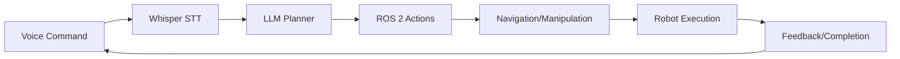

# Chapter 27: Evaluation & Extensions

## Overview
**What You'll Learn**: Testing, scoring, future directions

**Estimated Time**: 7-9 hours

## Core Concepts
Evaluation & Extensions demonstrates the culmination of Physical AI skills: integrating vision, language, and action into a cohesive system.

### System Diagram

## Implementation
Complete capstone project with voice control, autonomous navigation, and task execution.

## Lab
Build and demonstrate full integrated system.

## Summary
Capstone proves mastery of Physical AI development from concept to deployment.

**Next**: [Appendices](../08-appendix/index.md)
