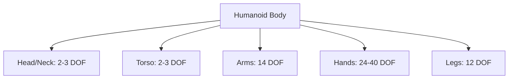

# Chapter 2: Humanoid Robotics Landscape

## Overview

### What You'll Learn
- **Identify** major humanoid robot platforms and their capabilities
- **Explain** embodiment principles and morphological considerations
- **Analyze** kinematic structures and degrees of freedom
- **Compare** design philosophies across different platforms

### Prerequisites
- ✅ Completed [Chapter 1](./01-introduction.md)
- ✅ Understanding of Physical AI concepts

### Chapter Roadmap
Covers modern humanoid platforms (Tesla, Unitree, Boston Dynamics), embodiment theory, kinematics, and hardware-software co-design.

**Estimated Time**: 4-5 hours

## Background

The humanoid form factor has evolved from research curiosity to commercial viability. Modern platforms leverage AI, improved actuators, and cost reduction to create capable general-purpose robots.

### Evolution of Humanoid Robotics

**1970s-1990s**: WABOT-1 (1973) first full-scale humanoid, Honda P-series research  
**2000-2010**: ASIMO, HRP series, research focus  
**2010-2020**: Atlas, HUBO, Pepper - demonstrations but limited deployment  
**2020+**: Optimus, G1, Figure 01 - commercial deployment focus

## Core Concepts

### Concept 1: Modern Humanoid Platforms

#### Tesla Optimus (Tesla Bot)
- **Purpose**: General-purpose assistant, manufacturing automation
- **Height**: ~5'8" (173 cm), Weight: ~125 lbs (57 kg)
- **Actuators**: 40+ DOF, custom linear actuators
- **Sensors**: 8 cameras (FSD computer), IMU
- **AI**: End-to-end neural networks, Vision-Language-Action
- **Status**: Prototypes in Tesla factories (2024)

#### Unitree G1/H1
- **Purpose**: Research platform, affordable humanoid
- **Cost**: G1 ~$16,000 (breakthrough pricing)
- **DOF**: 23-27 degrees of freedom
- **Sensors**: 3D LiDAR, depth cameras, joint encoders
- **Strengths**: Open platform, good value
- **Applications**: Research, education, light industrial

#### Boston Dynamics Atlas
- **Purpose**: Research platform, dynamic locomotion
- **Capabilities**: Parkour, backflips, complex manipulation
- **Hydraulic**: Earlier versions, newer models electric
- **Control**: Model-based control + RL
- **Status**: Not commercialized, research demonstrations

#### Agility Robotics Digit
- **Purpose**: Logistics, warehouse automation
- **Design**: Torso-legs only (no arms initially, arms added later)
- **Deployments**: Amazon warehouses, Ford plants
- **Focus**: Reliability over versatility

### Concept 2: Embodiment and Morphology

**Morphology** = physical form and structure

#### Why Humanoid?
- Human environments designed for human dimensions
- Stairs, doors, handles assume human morphology
- Can use human tools without redesign
- Leverage human demonstration data

#### Trade-offs:
**Advantages**:
- General purpose (one platform, many tasks)
- Intuitive for humans to work alongside
- Large training dataset (human videos)

**Disadvantages**:
- Unstable (bipedal balancing complex)
- Expensive (many actuators)
- Not optimal for any single task

### Concept 3: Kinematics and Degrees of Freedom

**Degrees of Freedom (DOF)**: Number of independent ways robot can move

#### Typical Humanoid DOF Budget:
- **Legs**: 6 DOF per leg (hip: 3, knee: 1, ankle: 2) = 12 total
- **Arms**: 7 DOF per arm (shoulder: 3, elbow: 1, wrist: 3) = 14 total
- **Hands**: 12-20 DOF per hand = 24-40 total
- **Torso/Neck**: 3-6 DOF
- **Total**: 50-70 DOF for full humanoid

More DOF = more versatility but harder to control.



*Figure 2.1: Typical humanoid DOF distribution*

## Implementation

### Tutorial: Analyzing Platform Specifications

Compare three platforms across key dimensions:

```python
# Humanoid comparison framework
platforms = {
    "Tesla Optimus": {
        "dof": 40,
        "weight_kg": 57,
        "height_m": 1.73,
        "cost_est": "Unknown",
        "status": "Development",
        "strength": "AI integration"
    },
    "Unitree G1": {
        "dof": 23,
        "weight_kg": 35,
        "height_m": 1.27,
        "cost_est": "$16,000",
        "status": "Available",
        "strength": "Affordability"
    },
    "Boston Dynamics Atlas": {
        "dof": 28,
        "weight_kg": 89,
        "height_m": 1.5,
        "cost_est": "$150,000+",
        "status": "Research",
        "strength": "Agility"
    }
}
```

## Lab Exercises

### Lab 1: Platform Comparison Analysis

**Objective**: Create detailed comparison of humanoid platforms

**Deliverables**:
- Comparison table (DOF, sensors, capabilities)
- Analysis of design philosophies
- Recommendation for specific use cases

## Summary

### Key Takeaways
1. Modern humanoids span from $16K (Unitree) to $150K+ (Atlas) with varying capabilities
2. Humanoid form chosen for versatility in human environments, not task optimization
3. DOF budget determines versatility vs. control complexity
4. Design philosophy varies: AI-first (Tesla) vs. dynamics-first (Boston Dynamics)

### Next Steps
➡️ [Chapter 3: Sensor Foundations](./03-sensor-foundations.md)
