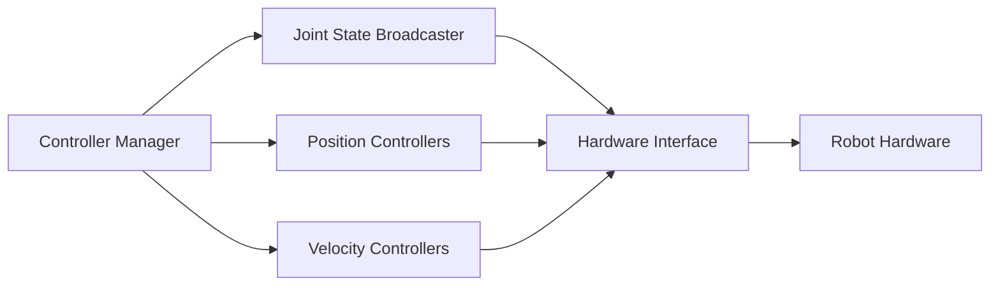

# Chapter 8: Control Systems for Humanoids

## Overview

**What You'll Learn**: Control theory basics, PID controllers, ROS 2 control framework, trajectory generation

**Estimated Time**: 7-9 hours

## Core Concepts

### PID Control

```python
class PIDController:
    def __init__(self, kp, ki, kd):
        self.kp = kp  # Proportional gain
        self.ki = ki  # Integral gain
        self.kd = kd  # Derivative gain

        self.prev_error = 0.0
        self.integral = 0.0

    def update(self, setpoint, measurement, dt):
        error = setpoint - measurement

        # P term
        p_term = self.kp * error

        # I term
        self.integral += error * dt
        i_term = self.ki * self.integral

        # D term
        derivative = (error - self.prev_error) / dt
        d_term = self.kd * derivative

        # Update
        self.prev_error = error

        # Control output
        output = p_term + i_term + d_term
        return output
```

### ROS 2 Control Architecture



### Trajectory Generation

```python
from trajectory_msgs.msg import JointTrajectory, JointTrajectoryPoint

def generate_trajectory(joint_names, positions, duration):
    traj = JointTrajectory()
    traj.joint_names = joint_names

    point = JointTrajectoryPoint()
    point.positions = positions
    point.time_from_start = Duration(seconds=duration)

    traj.points.append(point)
    return traj
```

## Lab: PID Tuning

**Objective**: Implement and tune PID controller for joint position control

**Tasks**:
1. Implement PID class in Python
2. Create test node that commands joint positions
3. Tune Kp, Ki, Kd gains for stable control
4. Plot response (setpoint vs. actual)

## Summary

**Key Takeaways**:
1. PID provides feedback control for position/velocity tracking
2. ROS 2 Control standardizes controller interfaces
3. Trajectory generation creates smooth motion plans
4. Controller tuning critical for stability and performance

**Next**: [Part III: Gazebo & Unity](../03-gazebo-unity/index.md)
