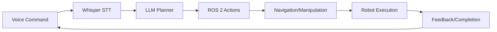

# Chapter 25: Implementation

## Overview
**What You'll Learn**: Voice commands → LLM → ROS actions → navigation

**Estimated Time**: 7-9 hours

## Core Concepts
Implementation demonstrates the culmination of Physical AI skills: integrating vision, language, and action into a cohesive system.

### System Diagram

## Implementation
Complete capstone project with voice control, autonomous navigation, and task execution.

## Lab
Build and demonstrate full integrated system.

## Summary
Capstone proves mastery of Physical AI development from concept to deployment.

**Next**: [Chapter 26](./26-sim-to-real.md)
